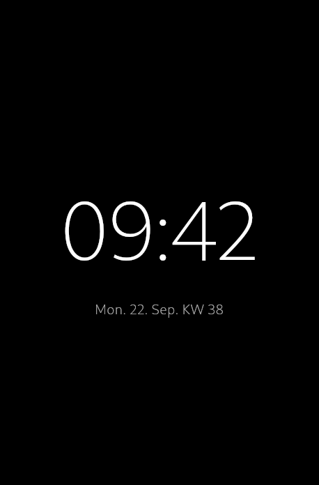
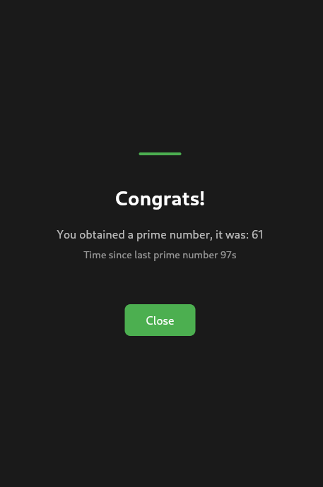

# Prime Clock

Our solution to a programming challenge for Deep Care.
A Flutter app that displays a digital clock, and checks when random numbers from an API are prime numbers.

## Features

- Digital clock display with date and week number
- Fetches random numbers from randomnumberapi.com every 10 seconds
- Shows celebration screen when a prime number is received
- Persists the last prime number and timestamp
- Displays time elapsed since the last prime number

## Getting Started

### Prerequisites
- Flutter SDK
- Dart SDK

### Installation
1. Clone the repository
2. Run `flutter pub get` to install dependencies
3. Run `flutter run` to start the app

### Dependencies
- `flutter_riverpod` - State management
- `shared_preferences` - Data persistence
- `http` - API calls
- `isprime` - Prime number checking
- `intl` - Date formatting

## Patterns & Libraries Used

**Riverpod for State Management**: Chosen for its type-safety, testability, and async state handling. The provider pattern separates business logic from UI and makes the app more maintainable.

**Repository Pattern**: The `AppStateNotifier` acts as a repository, handling API calls, persistence, and state mutations in one place rather than spreading logic across widgets.

**Async State Management**: Using `AsyncValue` to handle loading, error, and data states uniformly across the app.

**Periodic API calls**: Using `Timer.periodic` for consistent data fetching.

## Design Assumptions

**Network Availability**: Assumed the app will have internet connectivity. The app handles API failures but doesn't implement offline mode or retry logic.

**Random Number Range**: The randomnumberapi.com returns reasonable integers that can be efficiently checked for primality using the `isprime` library.

**Persistence Needs**: Only the last prime number and timestamp need persistence - no full history or analytics are required.

**KW**: Assumed it means "Kalendar Woche"

**Dark Mode**: Assumed the color theme provided doesn't depend on device's Dark/Light mode.

**Time difference accuracy**: Assumed time difference is trimmed to lower integer (not closest). Hence a difference of 29.998s will be shown as 29s instead of the more accurate 30s.

**Scalability**: Assumed further development such as model/widget tests, comprehensive debug logging for edge cases, color theme design etc would be out of scope of this challenge.

**Tests**: This app was tested on Linux desktop and Android physical device. Assumed more tests would be out of scope of this challenge.

## Example screens


*Figure 1: Main clock display showing current time and date*



*Figure 2: Celebration screen when a prime number is found*

## Sample logs

```zsh
Loaded state - lastPrime: 17, lastTime: 2025-09-22 09:41:44.395336
Received a non-prime number: 36.
Received a non-prime number: 49.
Received a non-prime number: 64.
Received a non-prime number: 25.
Received a non-prime number: 76.
Received a prime number: 61. Time since last: 97s.
Caching last prime 61 at time 09:43:21
Received a non-prime number: 58.
Received a non-prime number: 12.
Received a prime number: 2. Time since last: 29s.
Caching last prime 2 at time 09:43:51
```